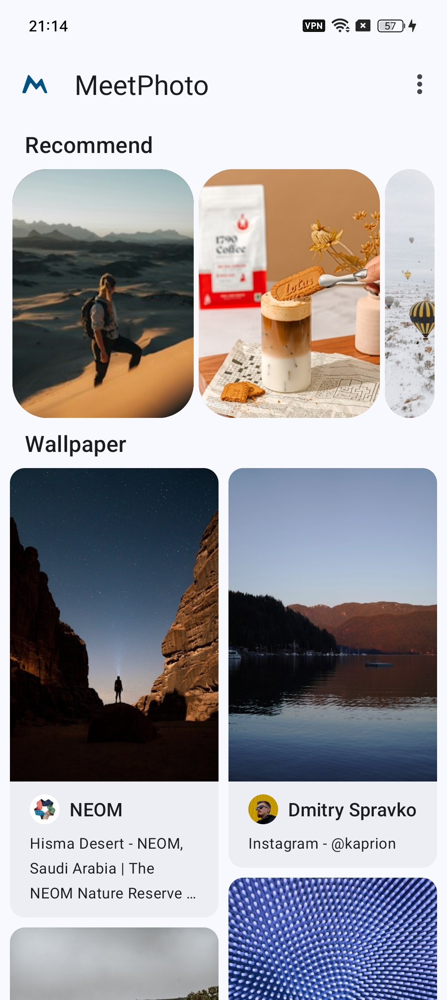
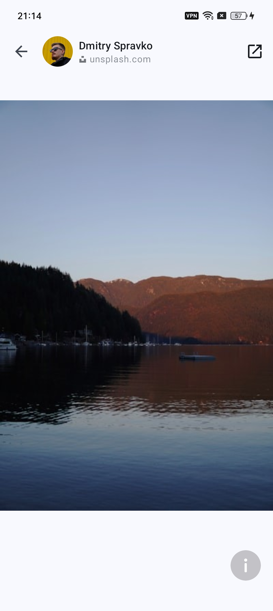
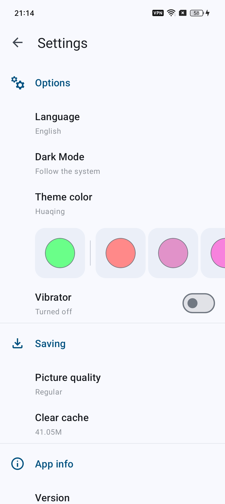

## MeetPhoto
MeetPhoto is a photo browsing app developed based on Unsplash Api.

It has the following functions:
* Adopting Material You style
* Image preview supports zooming in and out
* The image preview page supports drag and drop to exit
* Supports switching between Chinese and English
* Supports dark mode
* Support for selecting color themes

## Demo video
[MeetPhoto preview video](https://youtube.com/shorts/6k5GgJHmlIY?feature=share)

## Screenshots

## TO DO
Areas to be optimized：
* Language switching is not smooth
* Overloading high-definition photos during thumbnail preview will reset the image size

## License

Copyright &copy; 2019-2024 Dafay. All rights reserved.

[GNU General Public License version 3](https://www.gnu.org/licenses/gpl.txt)

> MeetPhoto is free software: you can redistribute it and/or modify it under the terms of the GNU General Public License as published by the Free Software Foundation, either version 3 of the License, or (at your option) any later version.
>
> MeetPhoto is distributed in the hope that it will be useful, but WITHOUT ANY WARRANTY; without even the implied warranty of MERCHANTABILITY or FITNESS FOR A PARTICULAR PURPOSE. See the GNU General Public License for more details.
